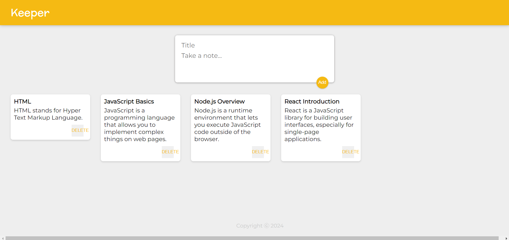

# Keeper App



Keeper App is a note-keeping application built with React. Users can add and delete notes, similar to the behavior of a digital sticky note system.

## Features

- **Add Notes**: Users can add notes with a title and content.
- **Delete Notes**: Users can delete individual notes.
- **Responsive Design**: The app is responsive and works on different screen sizes.

## Tech Stack

- **React.js**: Frontend library for building the user interface.
- **JavaScript (ES6)**: Modern JavaScript syntax and features.
- **CSS**: Styling the application.

## Installation

1. Clone the repository:

   ```bash
   git clone https://github.com/adityadhiman-in/keeper_app_reactjs.git
   ```

   `cd keeper_app_reactjs`

2. Install dependencies:

` npm install`

3. Start the application:

` npm run dev`

## Contact

Feel free to reach out if you have any questions or suggestions!

- [Website](https://adityadhiman.in)
- [GitHub](https://github.com/adityadhiman-in)
- [LinkedIn](https://www.linkedin.com/in/adityadhiman-in)

Made with ❤️ by [Aditya Dhiman](https://adityadhiman.in)
